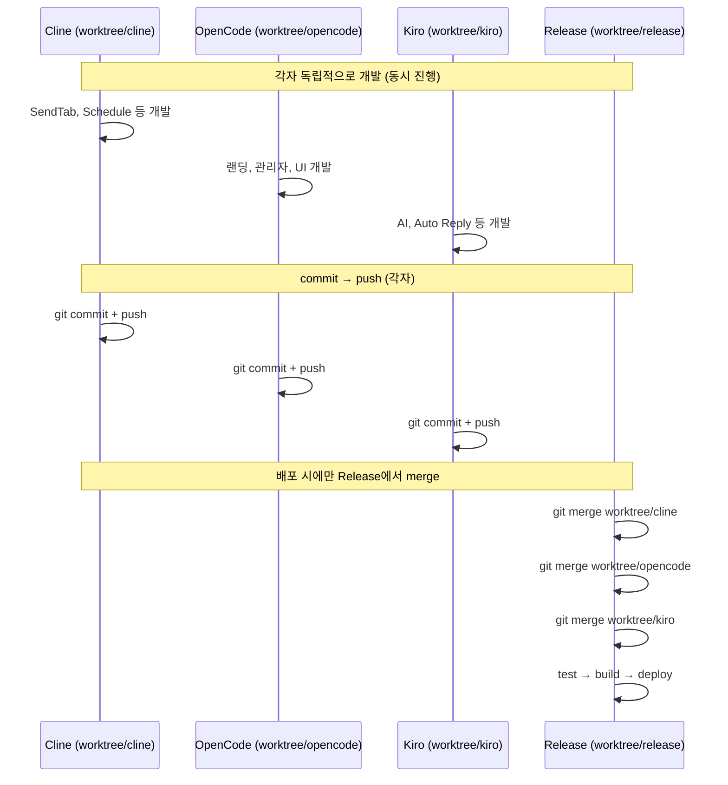

# TeleMon 병렬 개발 가이드

> Worktree 기반 AI Agent 병렬 개발을 위한 구조, 담당 영역, 충돌 관리 가이드

---

## 1. AI Agent별 담당 영역

### Cline (`c:\Dev\TeleMon-cline` → `worktree/cline`)

**담당 영역** — 프론트엔드 코어 + 전송/통신 기능

| 도메인 | Frontend | Backend |
|---|---|---|
| **Send** | `SendTab.tsx` | `app/api/batch.py`, `app/services/delivery.py` |
| **Recurring Schedule** | `RecurringScheduleTab.tsx` | `app/api/schedule.py`, `app/crud/recurring_schedule.py` |
| **Campaign** | `CampaignTab.tsx` | `app/api/campaign.py`, `app/crud/campaign.py` |
| **Folders** | `FoldersTab.tsx` | `app/api/folder.py`, `app/crud/folder.py` |
| **Webhook** | `WebhookSettingsTab.tsx` | `app/api/webhook_settings.py`, `app/services/webhook_service.py` |
| **코어/인프라** | `src/lib/api.ts`, `src/store/` | `app/core/`, `app/config.py`, `app/database.py` |

### OpenCode (`c:\Dev\TeleMon-opencode` → `worktree/opencode`)

**담당 영역** — 프론트엔드 UI/UX + 공개 페이지 + 관리자

| 도메인 | Frontend | Backend |
|---|---|---|
| **랜딩 페이지** | `src/app/(public)/`, `src/components/landing/` | `app/api/features.py` |
| **관리자** | `src/app/admin/`, `src/components/admin/` | `app/api/admin.py`, `app/api/auth.py` |
| **공통 UI** | `src/components/ui/` | — |
| **인증** | `src/lib/auth.ts` | `app/api/telegram_auth.py`, `app/core/security.py` |
| **결제** | `billing/pricing page` | `app/api/billing.py`, `app/services/billing.py` |
| **Layout** | `src/components/layout/` | — |

### Kiro (`c:\Dev\TeleMon-kiro` → `worktree/kiro`)

**담당 영역** — AI + 데이터 분석 + 검색 + 인텔리전스

| 도메인 | Frontend | Backend |
|---|---|---|
| **AI 서브시스템** | `Ai*Tab.tsx` | `app/ai/` (전체) |
| **Auto Reply** | `AutoReplyTab.tsx` | `app/api/auto_reply.py`, `app/services/auto_reply_service.py` |
| **Delivery Analytics** | `DeliveryAnalyticsTab.tsx` | `app/api/delivery_analytics.py`, `app/services/delivery_analytics.py` |
| **Group Search** | `GroupSearchTab.tsx` | `app/api/group_search.py`, `app/services/group_search_service.py` |
| **Link Inspector** | `LinkInspectorTab.tsx` | `app/api/link_inspector.py`, `app/services/link_inspector_service.py` |
| **Dashboard** | `DashboardTab.tsx` | `app/api/account_health*`, `app/services/telegram_membership.py` |

> **참고**: 위 영역 배분은 권장사항입니다. 실제 작업 상황에 따라 유연하게 조정할 수 있습니다.

---

## 2. 동시 진행 가능성 분석 — 핵심 결론

### ✅ ***거의 모든 작업이 동시 진행 가능합니다.** *

그 이유는 각 영역이 **완전히 분리된 파일 단위**로 구성되어 있기 때문입니다:

**백엔드 (`telegram-dashboard-backend/app/`):**
- `app/api/*.py` — 각 API router는 **완전히 독립된 파일**. 서로 import하지 않음
- `app/crud/*.py` — 각 CRUD는 **완전히 독립된 파일**. 서로 import하지 않음
- `app/services/*.py` — 각 Service는 **완전히 독립된 파일**. 서로 import하지 않음
- `app/schemas/*.py` — 각 Schema는 **완전히 독립된 파일**. 서로 import하지 않음
- `app/models/*.py` — 각 Model은 **완전히 독립된 파일**. 서로 import하지 않음

**프론트엔드 (`src/`):**
- `src/components/workspace/tabs/*.tsx` — 각 Tab은 **완전히 독립된 파일**. 서로 import하지 않음
- `src/components/landing/*.tsx` — 각 랜딩 컴포넌트는 **완전히 독립**
- `src/components/ui/*.tsx` — 각 UI 컴포넌트는 **완전히 독립**

### 충돌이 발생하는 유일한 경우

충돌은 **기존 파일을 여러 agent가 동시에 수정할 때만** 발생합니다. 아래가 그 유일한 대상입니다:

#### 유일한 공유 지점 (등록만 하면 됨)

| 파일 | 역할 | 충돌 조건 |
|---|---|---|
| `telegram-dashboard-backend/app/main.py` | 모든 API router를 import + `app.include_router()` | **새 router 추가 시 2줄 추가** |
| `src/components/layout/Workspace.tsx` | 모든 Tab 컴포넌트를 import + `TAB_CONTENT` 매핑 | **새 Tab 추가 시 2줄 추가** |
| `telegram-dashboard-backend/app/models/__init__.py` | 모든 Model을 import | **새 Model 추가 시 1줄 추가** |

> 위 파일들은 **기존 코드를 수정하는 것이 아니라 끝에 한 줄만 추가**하면 되므로, 여러 agent가 동시에 추가해도 merge 시 충돌이 발생하지 않거나, 발생해도 아주 쉽게 해결됩니다.

#### 주의가 필요한 공통 파일

| 파일 | 역할 | 대처 |
|---|---|---|
| `app/config.py` | 공통 설정값 | 변경 시 모든 팀 공유 |
| `app/database.py` | DB 연결 설정 | 거의 변경되지 않음 |
| `app/core/security.py` | 인증 유틸리티 | 거의 변경되지 않음 |
| `src/lib/api.ts` | API 클라이언트 | 각자 필요한 API 함수만 추가 (파일 끝에 추가) |

### ***결론: Tab/API/Service/Model/Schema 단위의 기능 개발은 100% 동시 진행 가능.** *

---

## 3. AI Agent별 병렬 작업 추천

### 각자 독립적으로 진행 가능한 작업 (동시에, 충돌 없음)

| # | Cline (clne) | OpenCode | Kiro |
|---|---|---|---|
| 1 | Send 기능 개선 | 랜딩 페이지 개선 | AI Copilot 개선 |
| 2 | Recurring Schedule | 관리자 페이지 | Auto Reply |
| 3 | Campaign | 공통 UI 컴포넌트 | Group Search |
| 4 | Folders | 인증/로그인 | Link Inspector |
| 5 | Webhook | 결제 페이지 | Delivery Analytics |
| 6 | Message Template | Signup 흐름 | Dashboard 위젯 |
| 7 | Reply Macro | Terms/Privacy | AI Usage Tab |
| 8 | Log Tab 개선 | Billing Success | AI Operations Center |
| 9 | Profile Tab | Changelog | Health Tab |
| 10 | i18n 번역 | Features 페이지 | AI Reply/Broadcast Assistant |

### 주의: 새로운 Tab을 추가할 때만 협의 필요

새로운 기능(새 Tab, 새 API, 새 Model)을 추가할 때는 아래 파일에 import 한 줄만 추가하면 됩니다:

```
# app/main.py — 라우터 등록: 2줄
from app.api.new_feature import router as new_feature_router
app.include_router(new_feature_router, dependencies=_auth_required)

# Workspace.tsx — 탭 등록: 2줄
import { NewFeatureTab } from "./tabs/NewFeatureTab";
const TAB_CONTENT: Record<TabId, React.ComponentType> = {
  newfeature: NewFeatureTab,
  // ...
};
```

이것들은 서로 다른 파일이므로 **동시에 각자 추가해도 충돌이 없습니다.**

---

## 4. 작업 흐름



### 중요 규칙

1. **절대 다른 agent의 worktree를 수정하지 않는다**
2. **개발 worktree에서 merge/rebase/deploy 하지 않는다**
3. **충돌 해결은 Release Worktree merge 시에만 수행한다**
4. **공통 파일(`config.py`, `database.py`, `security.py`) 변경 시 사전 공유**

---

> **최종 규칙**: "자신의 Worktree에서만 개발한다"는 원칙을 항상 기억하세요.
> 대부분의 작업은 서로 전혀 충돌나지 않으므로, 부담 없이 동시에 진행할 수 있습니다.